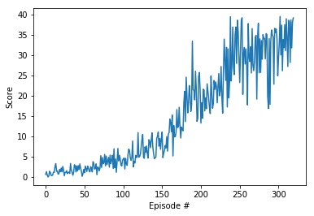

# Solving Reacher Environment with Deep Deterministic Policy Gradients

## Learning Algorithm

Deep Deterministic Policy Gradients algorithm is used in this project because of the continuous action space. 
The DDPG algorithm is implemented in the [Solution.ipynb](Solution.ipynb) file. 
Learning of continuous actions requires an actor (`Actor` class) and a critic (`Critic` class) model.
The actor model learns to predict an action vector while the critic model learns Q values for state-action pairs.
DDPG uses experience replay (`Replay` class) to sample batches of uncorrelated experiences to train on. 
It also distinguishes between local and target models for both actor and critic, similar to fixed Q-targets and double DQN technique.
Online models are updated by minimizing loses while target models are updated through soft update, 
i.e. local model parameters values are partially transferred to target models. 
This helps to avoid overestimation of Q-values and makes the training more stable.

The core of DDPG algorithm is implemented in the `Agent` class. 
The `act` method generates an action for the given state with the online actor model.
The `learn` method implements updates to the models and has the following flow:

1. A batch of experiences is sampled from the replay buffer.
2. Update online critic model
    1. Predict actions for the next states with the target actor model
    2. Compute Q-values for the next states and actions with the target critic model
    3. Compute target Q-values for the current states and actions using the Bellman equation
    4. Compute Q values for the current states and actions with the online critic model
    5. Use the target and local Q-values to compute the loss
    6. Minimize the loss for the local critic model
3. Update online actor model
    1. Predict actions for current states from the local actor model
    2. Compute Q-values with the local critic model
    3. Use the Q-values to compute the loss
    4. Minimize the loss for the local actor model
4. Soft update of the target critic and actor models

Training of the agent is implemented in the `run` function, which has the following flow:

1. Every timestep a state of the environment is observed
2. The agent selects an action
3. The environment provides the next state, the reward received and the information whether the episode is completed.
4. State, action, next state and the reward constitute the experience that the agent adds to its replay buffer.
5. When enough experiences are collected the agent learns as described above.
 
## Network architecture

DDPG uses two network architectures, one for actor and one for critic.
The actor network maps state to action and has the following structure:
 
1. State input (33 units)
2. Hidden layer (256 units) with ReLU activation and batch normalization
3. Hidden layer (256 units) with ReLU activation and batch normalization
4. Action output (4 units) with tanh activation

The critic network maps state and action to Q value and has the following structure:
1. State input (33 units)
2. Hidden layer (256 nodes) with ReLU activation and batch normalization
3. Action input (4 units)
4. Hidden layer with inputs from layers 2 and 3 (256 nodes) with ReLU activation and batch normalization
5. Q-value output (1 node)

## Hyperparameters

| Hyperparameter | Value | Description |
|---|---:|---|
| Replay buffer size | 1e5 | Maximum size of experience replay buffer |
| Replay batch size | 64 | Number of experiences sampled in one batch |
| Actor hidden units | 256, 256 | Number of units in hidden layers of the actor model |
| Actor critic units | 256, 256 | Number of units in hidden layers of the critic model |
| learning rate | 5e-4 | Controls parameters update of the online model |
| Target update mix | 1e-3 | Controls parameters update of the target actor and critic models |
| Max episodes | 3000 | Maximum number of episodes to train |
| Max steps | 1000 | Maximum number of timesteps per episode |
| Update Every | 4 | how often to update the network |
| Gamma | 0.99 | discount factor |


## Results

The agent was able to solve the environment by achieving score above 30 over 100 consecutive episodes after 320 episodes.


Plot of the scores:



```
Episode 100	Average Score: 2.31
Episode 200	Average Score: 10.70
Episode 300	Average Score: 27.19
Episode 320	Average Score: 30.16
Environment solved in 220 episodes!	Average Score: 30.16
```
## Trained agent:

After training the agent to meet the reqirements of the environment, this is what it looks like


## Future work

1. Better control of the exploration-exploitation trade-off by implementing a decreasing schedule for the sigma parameter of the
Ornstein-Uhlenbeck process.
2. Optimization of hyper parameters to solve the environent in fewer steps.
3. Implementing other Actor-Critic methods like A2C, A3C, and GAE methods and compare to find which algorithm is effective in this environment.


